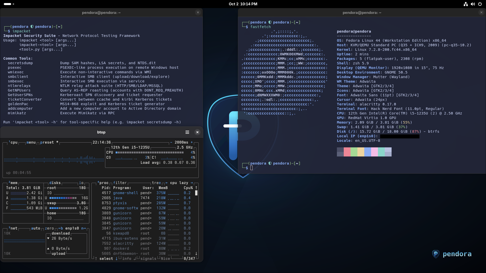

# Pendora 

[](https://fedoraproject.org/)
[](https://www.gnu.org/software/bash/)
[](https://www.lua.org/)
[](https://www.docker.com/)
[](https://www.qemu.org/)
[](https://www.kali.org/tools/)
[](https://swaywm.org/)
[](https://github.com/sec-moose/pendora)

> ⚠️ **Disclaimer & Notice**  
> * **AI-Assisted Development**: Artificial intelligence (AI) has been utilized for parts of this project, including code generation, deployment scripts, configuration templates, and documentation.  
> * **Third-Party & Vendor Scripts**: Certain upstream modules fetch and execute installation scripts directly from official vendor sources (notably SysReptor's installer at [`https://docs.sysreptor.com/install.sh`](https://docs.sysreptor.com/install.sh)). Users are strongly encouraged to inspect and read through all scripts thoroughly before executing them.  
> * **Use Entirely at Your Own Risk**: This project is provided "as is" without warranty of any kind. The creator assumes no responsibility or liability for third-party scripts, remote downloads, system misconfigurations, or data loss resulting from the use of this repository. By using, cloning, or running this project, you explicitly acknowledge and accept this.
**Pendora** is a modular installation framework and configuration template designed to transform a standard **Fedora Linux** installation into a penetration testing and security assessment virtual machine.

It brings the toolset, workflows, and aesthetics of Kali Linux to Fedora's modern ecosystem (Wayland, RPM/DNF, systemd) using a modular, human-editable list structure.

---

## Architecture

Pendora organizes tooling, services, and configuration into four dedicated tiers:

```
┌────────────────────────────────────────────────────────────────────────┐
│                                PENDORA                                 │
├───────────────────┬───────────────────┬────────────────┬───────────────┤
│ 1. Native DNF RPM │ 2. Pipx Isolated  │ 3. Containers  │ 4. Shell &    │
│    (pkg-lists/)   │    (pipx-lists/)  │    & Upstreams │    Look-&-Feel│
│                   │                   │   (upstreams/) │    (zsh/)     │
│ 109 Fedora pkgs   │ 11 Python tools   │ Portainer:7999 │ Zsh setup     │
│ Scanners, debug,  │ netexec, impacket │ SysReptor:8000 │ Completions   │
│ compilers, sniff  │ responder, sqlmap │ BloodHound:8080│ Aliases, hl   │
└───────────────────┴───────────────────┴────────────────┴───────────────┘
```

1. **Native Fedora RPMs (`pkg-lists/`)**: 109 packages verified directly against official Fedora repositories covering base compilers, networking, sniffers, web discovery, reversing, and forensics.
2. **Pipx Isolated Python Tools (`pipx-lists/`)**: Offensive Python utilities requiring isolated environments to prevent library conflicts with system Python (`netexec`, `impacket`, `certipy-ad`, `bloodhound-ce`, `updog`, `sqlmap`, etc.).
3. **Standalone Upstreams & Containers (`upstreams/`)**: Vendor installers, git clones, and Docker containers for enterprise suites (`metasploit`, `burpsuite`, `seclists`, `evil-winrm`, `zap`, `hack-font`, `rustscan`, `naabu`, `portainer`, `sysreptor`, `bloodhound`, `devtunnel`, `responder`).
4. **Interactive Shell Environment (`zsh/`)**: Interactive Zsh configuration with autosuggestions, syntax highlighting, and pentesting aliases.

> 📖 **Tool Quick-Reference Guide**: For common startup commands, usage examples, keybindings, and dashboard URLs for every tool in this repository, see [assets/TOOL_REFERENCE.md](assets/TOOL_REFERENCE.md).
---

## Desktop Choice: Retain GNOME or Deploy Sway
Pendora provides full flexibility over your graphical environment. You can choose whether you want a headless/GNOME-compatible pentest environment or the full dynamic tiling desktop experience:

> 💡 **Recommendation: Deploy Basic Install (`--basic`) or Full Sway Desktop (`--sway` / `--all`)**  
> * **Basic Install (`./install.sh --basic`)**: Keeps your default Fedora desktop (e.g. GNOME) intact while setting up all penetration testing tools, pipx utilities, Docker containers, and Kali-styled terminal configurations.
> * **Sway Desktop (`./install.sh --sway`)**: Deploys the lightweight, i3-compatible **Sway** Wayland tiling compositor paired with the modern **Noctalia** shell, Catppuccin Alacritty terminal, and screensharing portal services. Sway is **100% native in standard Fedora repositories** (zero external COPR repositories needed!).

| Mode | Flag | Target User / Use Case | Included Components |
|---|---|---|---|
| **Basic Install** | `--basic` (`-b`) | **Keep existing desktop** (e.g., Fedora GNOME). Best if you prefer standard desktop management or a pre-configured VM. | All pentest tools (00–60), Pipx tools, Docker containers, Kali Zsh prompt, Alacritty Catppuccin theme, Neovim/LazyVim, custom wallpapers, hostname. **Zero Sway changes.** |
| **Full Desktop** | `--all` (`-a`) | **Deploy dynamic tiling desktop** (Sway). Transforms your VM into a full standalone tiling environment. | Everything in Basic **plus** Sway compositor, Noctalia shell, screensharing systemd targets, and `.config/sway` dotfiles. |
| **Sway Desktop** | `--sway` (`-W`) | **Deploy complete standalone dynamic tiling desktop.** | Installs `70-sway.list`, sets up screensharing systemd service, deploys Sway & Noctalia configuration (Pendora theme), Zsh, Neovim/LazyVim, Alacritty, wallpapers, and user profile branding. |
<p align="center">
  
</p>
---

## Requirements & Test Environment

The scripts and package templates in this project are designed, tested, and validated against the following target environment:

* **Operating System**: Up-to-date [Fedora Workstation](https://fedoraproject.org/workstation/) (GNOME Desktop)
* **Virtualization**: Virtual Machine deployed in **Virtual Machine Manager (`virt-manager`)** powered by **QEMU + KVM**
* **Minimum Tested Baseline**: **4 Virtual Cores (vCPUs)**, **4 GB RAM**, and **25 GB Virtual Hard Drive (Disk)**
* **Recommended Specs for Active Use**:
  * **Processor**: **8 Virtual Cores (vCPUs)** *(recommended for fast multithreaded scanning and cracking: nmap, masscan, ffuf)*
  * **Memory**: **Minimum 8 GB RAM** *(recommended for running concurrent container stacks: SysReptor, BloodHound, and Portainer alongside Burp Suite and browser)*
  * **Total Disk Space**: **35–50 GB** *(provides comfortable headroom beyond the ~11 GB install footprint for wordlists, database dumps, and captures)*
* **Storage Footprint Details**:
  * **Installation Size**: The full script deploys **~11 GB** of software across native RPMs, Pipx virtualenvs, standalone tools, wordlists (SecLists), and Docker container images. During active installation, peak usage reaches **~18–19 GB** due to temporary package caches and container layer downloads.
  * **Minimum VM Disk**: **25 GB** *(tested working baseline for a clean installation)*.
* **Privileges**: Regular user account with `sudo` permissions (**do NOT run the script as `sudo`**)
* **Connectivity**: Active internet connection to reach Fedora DNF mirrors, GitHub, PyPI, and Docker Hub
### Prerequisites Before Running

1. **Update System First**:
   Always perform a full system update before executing the script:
   ```bash
   sudo dnf upgrade --refresh -y
   ```
   *(Reboot the VM if a new kernel or systemd packages were installed).*

2. **Execution Permissions & Non-Root Execution**:
   > ⚠️ **Important:** **Do NOT run `install.sh` as `sudo`** (i.e. avoid `sudo ./install.sh`).
   > Always run it as your regular user: `./install.sh --all`.
   > The script handles `sudo` internally for tasks requiring root (DNF, hostname, Docker service). Running the entire script under `sudo` will incorrectly install user tools (`pipx`, `.zshrc`) into `/root/` instead of your user environment.

3. **Installation Duration, Prompts & Network Downloads**:
   * **Attendance Required**: The full installation takes significant time to complete (typically 15–30 minutes depending on your hardware and network connection) as it installs 120+ RPMs, builds Python wheels, downloads multi-gigabyte wordlists (SecLists), and pulls Docker container images.
   * **Sudo & Interactive Pauses**: Keep an eye on the terminal. The script periodically requests your `sudo` password for privileged operations and pauses to present generated credential cards (Portainer setup token, SysReptor credentials, BloodHound password) waiting for `[Enter]` to proceed.
   * **OWASP ZAP & Dev Tunnels Downloads**: During the upstream installations, downloading **OWASP ZAP** (Flatpak runtimes: `org.freedesktop.Platform`, GNOME runtime, codecs) and the standalone **Microsoft Dev Tunnels CLI** (`devtunnel`) binary takes time. The terminal may appear frozen or idle for several minutes while downloading these packages. **This is completely normal and has not hung during testing** — do not terminate the process; it will proceed automatically once the downloads finish.
---

## Directory Structure

```text
pendora/
├── install.sh                  # Central orchestrator and deployment script
├── README.md                   # Project documentation
├── pkg-lists/                  # Plain-text native DNF package lists
│   ├── 00-base.list            # System environment, compilers, stow, zsh, tmux, pipx
│   ├── 10-networking.list      # Port scanners, DNS enumeration, sniffers, VPN, routing
│   ├── 20-web.list             # Web security discovery & fuzzers (ffuf, gobuster, etc.)
│   ├── 30-forensics.list       # Reverse engineering, debuggers, static analysis (radare2, gdb)
│   ├── 40-auditing.list        # Password cracking & credential auditing (john, hashcat, hydra)
│   ├── 50-wireless.list        # 802.11 wireless security (aircrack-ng, kismet, reaver)
│   ├── 60-docker.list          # Docker daemon (moby-engine), CLI, and Docker Compose
│   └── 70-sway.list            # Sway tiling compositor, portals, Noctalia shell, dependencies
├── pipx-lists/                 # Isolated Python tool lists
│   └── pipx-tools.list         # netexec (git), impacket, certipy-ad, bloodhound-ce, updog, etc.
├── upstreams/                  # Standalone third-party installers
│   ├── install-upstreams.sh    # Metasploit, Burp, SecLists, Evil-WinRM, ZAP, Font, RustScan, Naabu, Portainer, SysReptor, BloodHound, Dev Tunnels, Responder
│   └── README.md
├── alacritty/                  # Alacritty terminal & Catppuccin Macchiato theme
│   └── .config/alacritty/      # alacritty.toml, catppuccin-macchiato.toml (Stow-compatible)
├── sway/                       # Sway tiling window manager & Noctalia shell
│   └── .config/sway/           # config (Stow-compatible)
│   └── .config/noctalia/       # config.toml, palettes/Pendora.json (Stow-compatible)
├── nvim/                       # Neovim, LazyVim & Catppuccin Macchiato theme
│   └── .config/nvim/           # init.lua, lazy.lua, plugins/colorscheme.lua (Stow-compatible)
└── zsh/                        # Shell styling & dotfiles
    └── .zshrc                  # Kali prompt with Fedora logo and pentesting shortcuts
```

---

## Web Services & Dashboards

| Service | Port / Protocol | Local URL | Description |
|---|---|---|---|
| **Portainer CE** | `7999` (HTTPS) | `https://localhost:7999` | Lightweight Docker management web dashboard |
| **SysReptor** | `8000` (HTTP) | `http://localhost:8000` | Pentest reporting platform (uses official [SysReptor install script](https://docs.sysreptor.com/install.sh)) |
| **BloodHound CE** | `8080` (HTTP) | `http://localhost:8080` | Active Directory attack path analysis & visualization |

*(For full credentials, startup commands, and terminal workflows across all categories, see the [Tool Reference Guide](assets/TOOL_REFERENCE.md)).*
> ℹ️ **Third-Party Script Notice**: The SysReptor deployment pulls and executes the vendor's official installer from [`https://docs.sysreptor.com/install.sh`](https://docs.sysreptor.com/install.sh). Users should always review third-party scripts before running them.


## How to Customize Package Lists

All files in `pkg-lists/` and `pipx-lists/` are structured for manual editing. The parser in `install.sh` automatically ignores empty lines and strips inline comments (`# ...`).

* **To disable a tool temporarily**: Prepend a `#` to the line:
  ```text
  # masscan                     # Ultra-fast TCP port scanner
  ```
* **To remove a tool permanently**: Delete the line from the file.
* **To add a new package**: Add the package name on a new line (inline comments optional):
  ```text
  cifs-utils                    # SMB/CIFS filesystem mount utilities
  ```

---

## Usage Instructions

Make sure the installer scripts are executable:

```bash
chmod +x install.sh upstreams/install-upstreams.sh
```

*(Run all commands as your regular user, never with `sudo ./install.sh`)*

### 1. Inspect Available Modules & Tool Counts
View a complete summary of all available package categories, Pipx tools, and upstream services:

```bash
./install.sh --list
```

### 2. Dry-Run Simulation (Recommended First Step)
Simulate execution to view every planned command and package without making system changes:

```bash
# Preview full installation across all four tiers
./install.sh --all --dry-run

# Preview only native DNF package installations
./install.sh --dry-run
```

### 3. Modular / Granular Installation
Install only the specific components you need:

```bash
# Install specific DNF categories only
./install.sh -c 10-networking -c 30-forensics

# Install only Docker engine packages
./install.sh -c 60-docker

# Install Docker engine AND deploy all containers (Portainer, SysReptor, BloodHound)
./install.sh --docker
# Install only Pipx-isolated Python security tools
./install.sh --pipx

# Deploy only the Kali/Fedora Zsh configuration
./install.sh --zsh

# Deploy complete Sway desktop stack, Noctalia shell, Zsh, Neovim, Alacritty & wallpapers
./install.sh --sway

# Deploy Alacritty terminal configuration & Catppuccin theme
./install.sh --alacritty

# Deploy Neovim/LazyVim configuration & Catppuccin theme
./install.sh --nvim
# Deploy and apply Pendora custom desktop wallpapers
./install.sh --wallpaper

# Set system hostname to 'pendora'
./install.sh --hostname
# Run specific upstream targets directly
cd upstreams
./install-upstreams.sh portainer sysreptor bloodhound devtunnel responder hack-font
```

### 4. Basic Installation (Recommended - Excluding Sway)
Install the complete penetration testing environment (all security packages 00-60, Pipx tools, Upstreams/containers, Zsh, Alacritty, Neovim, Hostname) while keeping your existing desktop environment (e.g., GNOME) intact:

```bash
# Interactive run
./install.sh --basic

# Non-interactive automated run
./install.sh --basic --yes
```

### 5. Full Installation (Including Sway Desktop)
Installs the complete toolkit and sets up the Sway tiling compositor stack (`70-sway.list`, screensharing systemd target, and `.config/sway` configuration):

```bash
# Interactive run (prompts before DNF transaction)
./install.sh --all

# Non-interactive automated run
./install.sh --all --yes
```

## Post-Installation

All shell configurations, font definitions, and group memberships are **automated** during execution:

* **Default Login Shell**: Automatically updated to Zsh (`/bin/zsh`) for your user account.
* **Docker Permissions**: Your user is added to the `docker` supplementary group.
* **Terminal Iconography**: Alacritty is pre-configured with `Hack Nerd Font` to render the Fedora prompt logos and glyphs.

To apply new group memberships and graphical session targets, simply reboot the system:

```bash
sudo reboot
```
